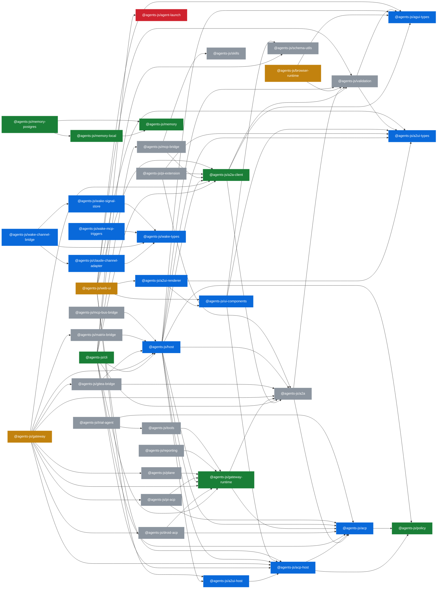

<!-- AUTO-GENERATED by scripts/capability-status.ts — do not edit -->
<!-- Source of truth: scripts/capability-status.json + docs/public/graph.json -->

```mermaid
graph LR
  classDef demonstrated fill:#1a7f37,stroke:#1a7f37,color:#fff;
  classDef undemonstrated fill:#0969da,stroke:#0969da,color:#fff;
  classDef overclaimed fill:#c2820e,stroke:#c2820e,color:#fff;
  classDef missing fill:#cf222e,stroke:#cf222e,color:#fff;
  classDef untiered fill:#8c959f,stroke:#8c959f,color:#fff;
  a2a["@agents-js/a2a"]:::untiered
  a2a_client["@agents-js/a2a-client"]:::demonstrated
  a2ui_host["@agents-js/a2ui-host"]:::undemonstrated
  a2ui_renderer["@agents-js/a2ui-renderer"]:::undemonstrated
  a2ui_types["@agents-js/a2ui-types"]:::undemonstrated
  acp["@agents-js/acp"]:::undemonstrated
  acp_host["@agents-js/acp-host"]:::undemonstrated
  agent_launch["@agents-js/agent-launch"]:::missing
  agui_types["@agents-js/agui-types"]:::undemonstrated
  browser_runtime["@agents-js/browser-runtime"]:::overclaimed
  claude_channel_adapter["@agents-js/claude-channel-adapter"]:::undemonstrated
  cli["@agents-js/cli"]:::demonstrated
  droid_acp["@agents-js/droid-acp"]:::untiered
  gateway["@agents-js/gateway"]:::overclaimed
  gateway_runtime["@agents-js/gateway-runtime"]:::demonstrated
  gitea_bridge["@agents-js/gitea-bridge"]:::untiered
  host["@agents-js/host"]:::undemonstrated
  matrix_bridge["@agents-js/matrix-bridge"]:::untiered
  mcp_bridge["@agents-js/mcp-bridge"]:::untiered
  mcp_bus_bridge["@agents-js/mcp-bus-bridge"]:::untiered
  memory["@agents-js/memory"]:::demonstrated
  memory_local["@agents-js/memory-local"]:::demonstrated
  memory_postgres["@agents-js/memory-postgres"]:::demonstrated
  pi_acp["@agents-js/pi-acp"]:::untiered
  pi_extension["@agents-js/pi-extension"]:::untiered
  plane["@agents-js/plane"]:::untiered
  policy["@agents-js/policy"]:::demonstrated
  reporting["@agents-js/reporting"]:::untiered
  schema_utils["@agents-js/schema-utils"]:::untiered
  skills["@agents-js/skills"]:::untiered
  tools["@agents-js/tools"]:::untiered
  trial_agent["@agents-js/trial-agent"]:::untiered
  ui_components["@agents-js/ui-components"]:::undemonstrated
  validation["@agents-js/validation"]:::untiered
  wake_channel_bridge["@agents-js/wake-channel-bridge"]:::undemonstrated
  wake_mcp_triggers["@agents-js/wake-mcp-triggers"]:::undemonstrated
  wake_signal_store["@agents-js/wake-signal-store"]:::undemonstrated
  wake_types["@agents-js/wake-types"]:::undemonstrated
  web_ui["@agents-js/web-ui"]:::overclaimed
  a2a_client --> a2a
  a2a_client --> agui_types
  a2a_client --> validation
  a2a --> acp
  a2a --> validation
  a2ui_host --> acp_host
  a2ui_renderer --> a2ui_types
  a2ui_renderer --> ui_components
  acp_host --> acp
  acp_host --> policy
  acp --> policy
  browser_runtime --> agui_types
  browser_runtime --> validation
  claude_channel_adapter --> wake_types
  cli --> a2a
  cli --> a2a_client
  cli --> acp
  cli --> acp_host
  cli --> agent_launch
  cli --> gateway_runtime
  cli --> host
  cli --> mcp_bridge
  cli --> schema_utils
  droid_acp --> acp
  droid_acp --> gateway_runtime
  gateway_runtime --> a2a
  gateway_runtime --> acp
  gateway --> a2a
  gateway --> a2a_client
  gateway --> acp_host
  gateway --> droid_acp
  gateway --> gateway_runtime
  gateway --> gitea_bridge
  gateway --> host
  gateway --> matrix_bridge
  gateway --> pi_acp
  gateway --> plane
  gitea_bridge --> a2a
  gitea_bridge --> host
  host --> a2a
  host --> a2a_client
  host --> a2ui_host
  host --> a2ui_types
  host --> acp
  host --> acp_host
  host --> agui_types
  host --> gateway_runtime
  host --> policy
  host --> validation
  matrix_bridge --> host
  mcp_bridge --> a2a_client
  mcp_bridge --> skills
  mcp_bus_bridge --> host
  memory_local --> memory
  memory_postgres --> memory
  memory_postgres --> memory_local
  pi_acp --> acp
  pi_acp --> gateway_runtime
  pi_extension --> a2a
  pi_extension --> a2a_client
  pi_extension --> a2ui_types
  plane --> gateway_runtime
  reporting --> gateway_runtime
  tools --> gateway_runtime
  trial_agent --> acp
  trial_agent --> tools
  ui_components --> a2ui_types
  ui_components --> acp_host
  ui_components --> schema_utils
  validation --> a2ui_types
  validation --> agui_types
  wake_channel_bridge --> claude_channel_adapter
  wake_channel_bridge --> wake_signal_store
  wake_channel_bridge --> wake_types
  wake_mcp_triggers --> wake_types
  wake_signal_store --> wake_types
  web_ui --> a2a_client
  web_ui --> a2ui_host
  web_ui --> a2ui_renderer
  web_ui --> a2ui_types
  web_ui --> acp_host
  web_ui --> agui_types
  web_ui --> ui_components
  web_ui --> validation
```
