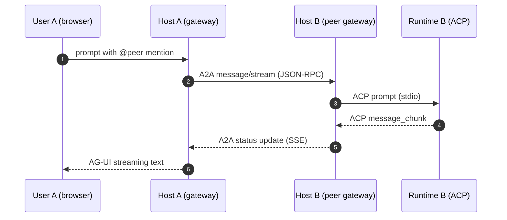

# Protocols at a glance

A primer for every acronym in the agents-js stack. If you already know ACP, A2A, MCP, AG-UI, A2UI, TOON, and JSON-RPC, skip to [Protocols & Schemas](/protocols) for the standards map.

> **Naming caveat.** The "ACP" agents-js implements is **Zed's Agent Client Protocol** — a local stdio JSON-RPC spec for agent subprocesses. It is unrelated to IBM's earlier "ACP" (which merged into A2A in September 2025) and unrelated to the W3C's defunct "Agent Communication Protocol" of the late 1990s. Same acronym, different specs.

## The stack

agents-js composes seven standards into one coherent surface. Each one solves a different boundary.

The diagram in markdown form: each row is a layer, each cell is a standard.

| Layer | Standard | Solves | agents-js packages |
|---|---|---|---|
| **Presentation** | A2UI | Agent declares UI as data; renderer hydrates it | `@agents-js/a2ui-renderer`, `@agents-js/a2ui-host` |
| **Presentation** | AG-UI | Streaming transport for agent events to user UIs | `@agents-js/agui-types` |
| **Integration** | A2A | Cross-network agent-to-agent messaging | `@agents-js/a2a`, `@agents-js/a2a-client` |
| **Integration** | MCP | Tool / resource / context exposure to MCP hosts | `@agents-js/mcp-bridge` |
| **Runtime** | ACP | Host launches agent subprocess over stdio | `@agents-js/acp`, `@agents-js/acp-host` |
| **Wire** | TOON | Token-optimized encoding for LLM-consumed docs | consumer (governance artifacts) |
| **Wire** | JSON-RPC | Battle-tested request/response envelope | standard (consumed via SDKs) |

## Long-form, protocol by protocol

### ACP — Agent Client Protocol

**Where it sits:** Runtime layer — local session control.
**What it solves:** How a host process launches an agent subprocess and exchanges prompts, permissions, and file operations with it over stdio.
**In agents-js:** `@agents-js/acp` (client) + `@agents-js/acp-host` (host embedding). Every harness adapter (claude, codex, opencode, gemini, pi, droid) speaks ACP as its local-boundary contract.
**Deeper:** [Protocols → ACP](/protocols#acp), [Harness Guide](/harness-guide).

### A2A — Agent-to-Agent Protocol

**Where it sits:** Integration layer — remote messaging between agents.
**What it solves:** How one agent delivers a message to another agent across a network boundary, with streaming support, structured responses, and card-based discovery.
**In agents-js:** `@agents-js/a2a` + `@agents-js/a2a-client`. The internal gateway wraps a local ACP runtime as an A2A endpoint so browsers, terminals, and other agents can reach it over HTTP.
**Deeper:** [Protocols → A2A](/protocols#a2a), [Primitives](/primitives).

### MCP — Model Context Protocol

**Where it sits:** Integration layer — tool + context exposure.
**What it solves:** How an agent or service exposes tools, resources, and context to an MCP host (Claude Code, Cursor, Zed, etc.).
**In agents-js:** `@agents-js/mcp-bridge` turns any A2A agent into an MCP tool. Progressive discovery avoids context bloat; tools load on demand.
**Deeper:** [Protocols → MCP](/protocols#mcp).

### AG-UI — Agent-User Interaction Protocol

**Where it sits:** Presentation layer — streaming transport to UIs.
**What it solves:** How agent events (streaming text, tool calls, activity, state deltas) reach a user-facing UI in real time. Superset transport — carries MCP apps, A2A payloads, and A2UI blueprints.
**In agents-js:** `@agents-js/agui-types` ships the event vocabulary. The gateway's AG-UI endpoint feeds the reference browser UI and the Obsidian plugin.
**Deeper:** [Streaming, Events, and Concurrency](/streaming-and-events).

### A2UI — Agent-to-UI (Google's declarative-UI spec)

**Where it sits:** Presentation layer — UI blueprint format.
**What it solves:** How an agent declares what the UI should look like without writing rendering code. Schema → renderer mapping with recurrent elements, cards, widgets, and interactive components.
**In agents-js:** `@agents-js/a2ui-types` + `@agents-js/a2ui-renderer` + `@agents-js/a2ui-host` + `@agents-js/a2ui-host/acp-host`. AG-UI transports A2UI payloads; renderers hydrate them into live components.
**Deeper:** [Surfaces → A2UI](/surfaces).

### TOON — Token-Optimized Object Notation

**Where it sits:** Wire layer — encoding for LLM-first documents.
**What it solves:** A compact, LLM-friendly alternative to JSON/YAML for documents primarily consumed by language models. Minimizes token cost while preserving structure.
**In agents-js:** Consumer only. Used for governance artifacts and LLM-consumed configuration where token efficiency matters. agents-js does not extend or define TOON.

### JSON-RPC 2.0

**Where it sits:** Wire layer — envelope.
**What it solves:** Standard request/response + error envelope for ACP and A2A. Battle-tested; no invention.
**In agents-js:** Implementation detail — agents-js consumes established SDKs.

## How the protocols compose in practice

A single agent-to-agent delegation touches four of them:

- **Step 2** uses A2A over JSON-RPC to cross the host boundary.
- **Step 3** uses ACP over JSON-RPC inside Host B's machine.
- **Step 7** streams via AG-UI so User A sees progressive output.
- If the final answer includes structured UI, that payload is A2UI, carried inside the AG-UI stream.

A short mermaid sequence as a fallback rendering:

## What agents-js ships and doesn't

| Protocol | agents-js role |
|---|---|
| ACP | **First-party** — implements host + client, tests and maintains harness adapters |
| A2A | **First-party** — implements server (`@agents-js/a2a`) + client (`@agents-js/a2a-client`) |
| MCP | **Bridge** — consumes external MCP SDKs; exposes A2A agents as MCP tools |
| AG-UI | **First-party transport types** — event vocabulary in `@agents-js/agui-types` |
| A2UI | **Consumer** — implements renderers + hosts against Google's declarative spec |
| TOON | **Consumer** — used in select LLM-first documents; not extended |
| JSON-RPC | **Standard** — no agents-js code; consumes established libraries |

## Where to go next

- **Run it now** → [Get Started](/getting-started)
- **Full standards map + extension boundaries** → [Protocols & Schemas](/protocols)
- **Embedding inside your own host** → [Harness Guide](/harness-guide)
- **The package graph itself** → [Dependencies](/develop/dependencies)
